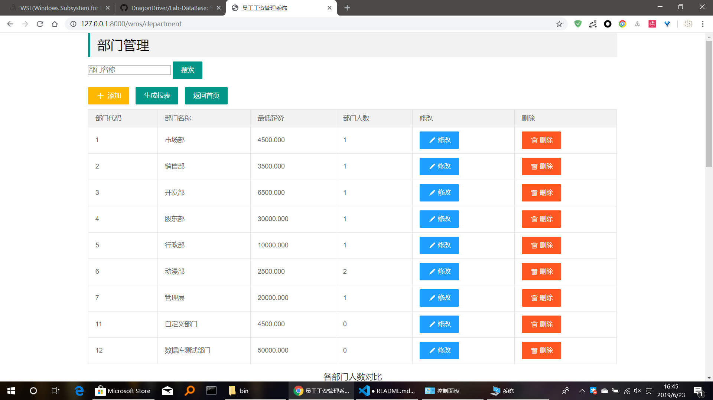
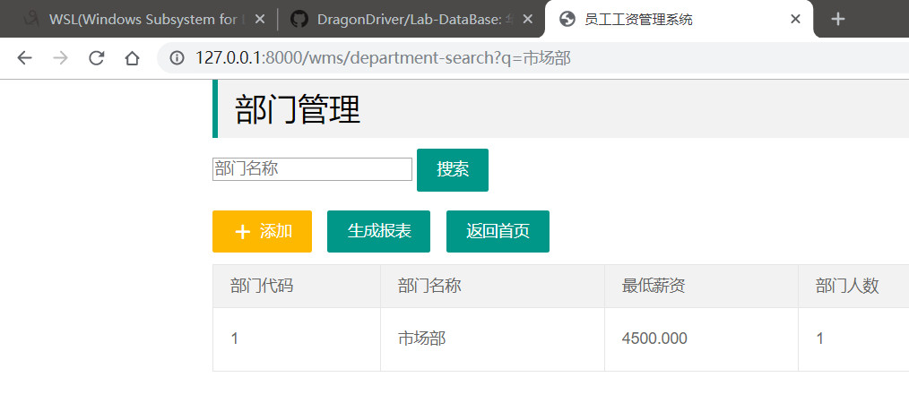
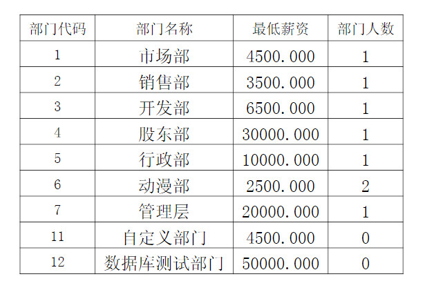

## 文档
[django后台网站开发中文文档](https://docs.djangoproject.com/zh-hans/2.2/ "django中文文档")

[highcharts网页图表生成](https://www.runoob.com/highcharts/highcharts-tutorial.html "highcharts菜鸟教程")

[reportlab生成PDF图表](https://www.reportlab.com/docs/reportlab-userguide.pdf "reportlab user guide")

## 注意事项
```
时间仓促，未能集成cookie模块到登录访问控制中，
因此系统的登录其实只是虚有其表，不登录也可以访问网站其他网址。
```

## 如何使用
```
由于时间仓促，未能将项目依赖打包到虚拟环境venv中，所以需要手动安装依赖，但也非常简单
安装`python3.6`及以上版本
安装项目依赖，在lab3-wms根目录下执行`pip install -r requirements.txt`即可
进入`lab3-wms`根目录执行`python manage.py runserver`运行服务器
在浏览器中输入`http://127.0.0.1:8000/`即可，初始登录用户名为`ljq'，密码为`fuck`
```

## ER图


## 登录


## 主页


## 部门管理主页



## 增加部门


## 修改部门


## 搜索部门



## 部门报表PDF生成



## 特色功能饼状图


